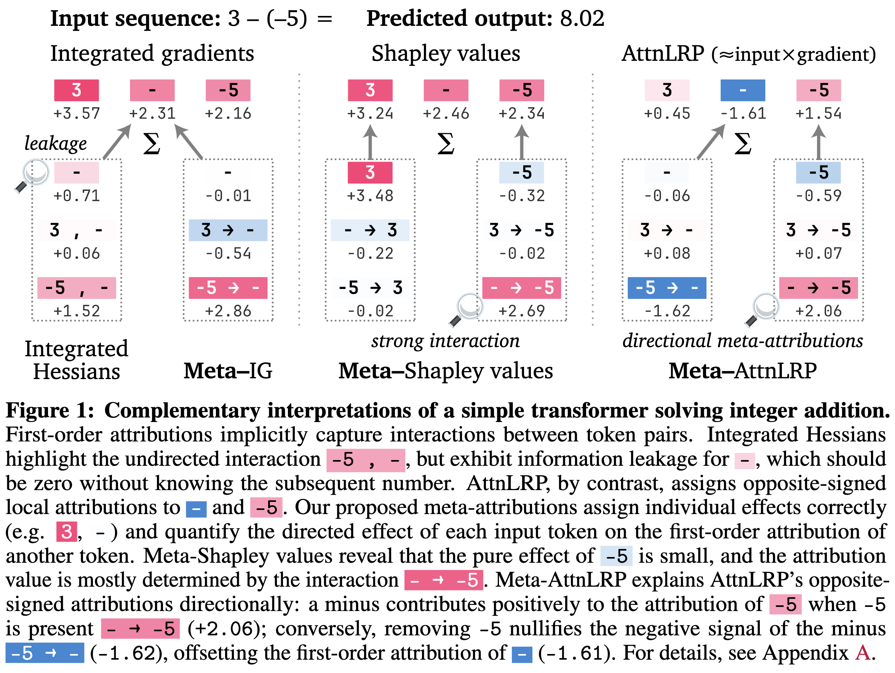
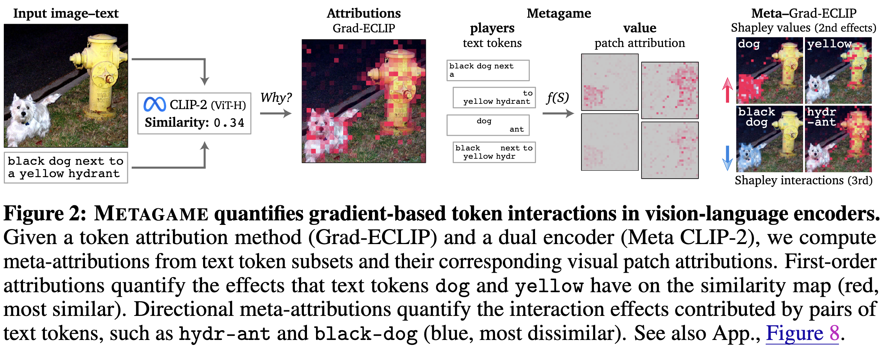
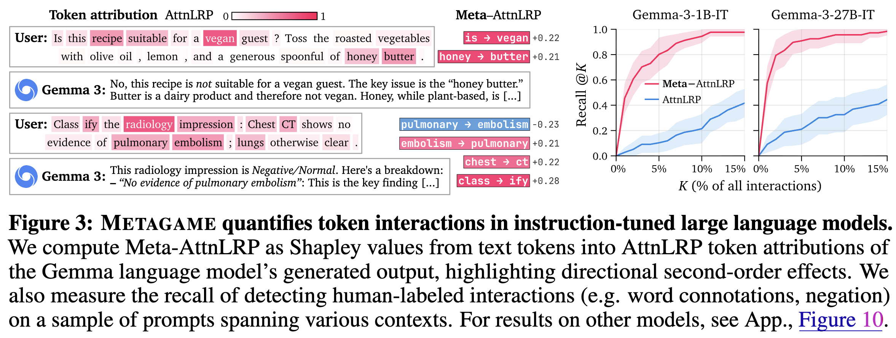
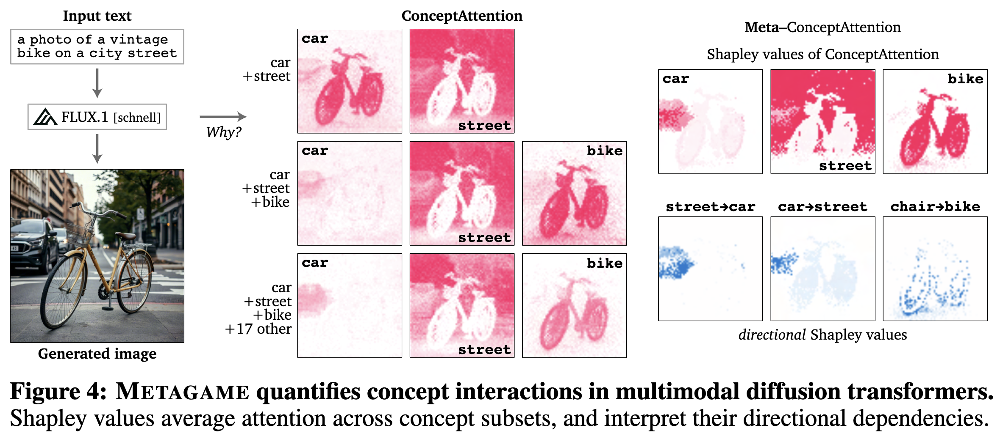

# metagame

This repository contains the raw supplementary code and metadata for the preprint:

> Hubert Baniecki, Przemyslaw Biecek, Fabian Fumagalli. **Attributions All the Way Down? The Metagame of Interpretability** https://arxiv.org/abs/2605.06295

